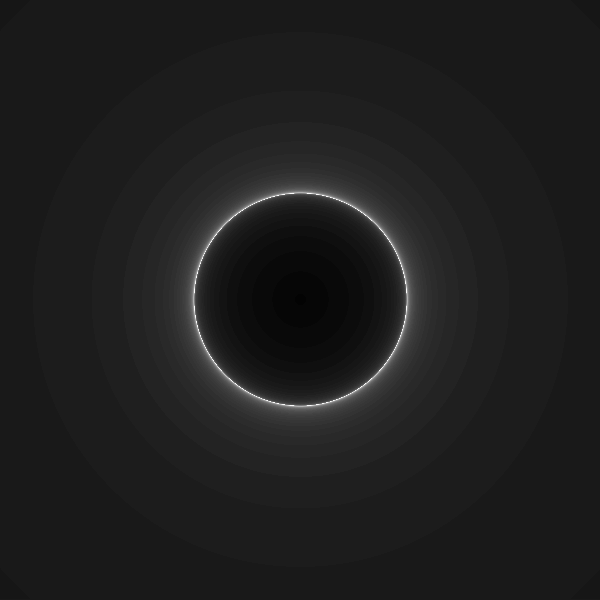
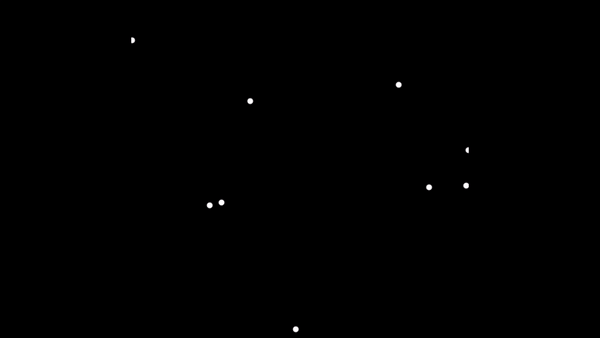
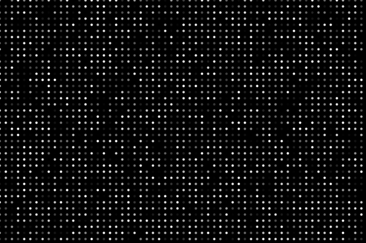

## Digital Doodles

A collection of little images and visualizations that I've created

### Processing

These are doodles that I've made using [Processing](https://processing.org/examples), a Java library for sketching and making visualizations with code. I have several other works in progress. I also have plans to convert many of these doodles from static assets to in-browser simulations using the [p5.js](https://p5js.org/examples/) library.

#### Mandelbulb
A 3D fractal, not too dissimilar from the Mandelbrot set. Shown as a point cloud with a camera library called [Peasycam](https://mrfeinberg.com/peasycam/) attached. Made as a 1:1 follow-along to this [Coding Train video.](https://www.youtube.com/watch?v=NJCiUVGiNyA)

#### Ray Marching
[Ray-Marching](https://en.wikipedia.org/wiki/Ray_marching) is a method for rendering which allows the creation of any shape. All that is required is the mathematical formula defining the boundaries of that shape, called a [signed distance function](https://en.wikipedia.org/wiki/Signed_distance_function).  Here is my visualization of a sphere shown by the iterations or "marches" that were required to determine if a ray from the camera would hit or miss the sphere. 

#### Traveling Salesman
A brute force solution to the [traveling salesman problem.](https://en.wikipedia.org/wiki/Travelling_salesman_problem) What is the shortest distance between all of these points? By checking the distance of every possible route, we can know for sure! I want to look into other ways of solving routing problems, particularly [A*](https://en.wikipedia.org/wiki/A*_search_algorithm). This also started as a follow-along to this [Sebastian Lague video](https://youtu.be/X-iSQQgOd1A?si=Y0BvPVPOWGXGCbmh) on slime molds.

#### Noise dots
Noise visualization using dots with a value of 0-255

